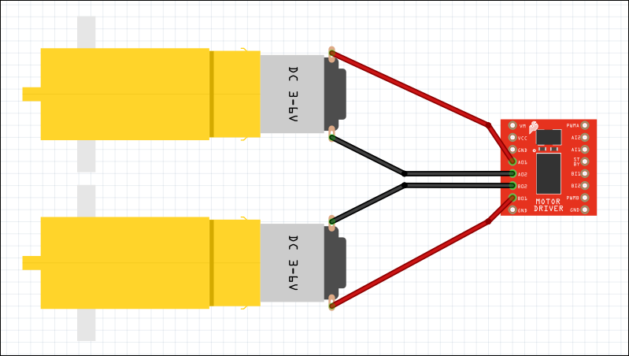
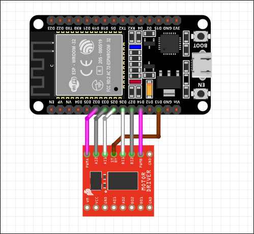
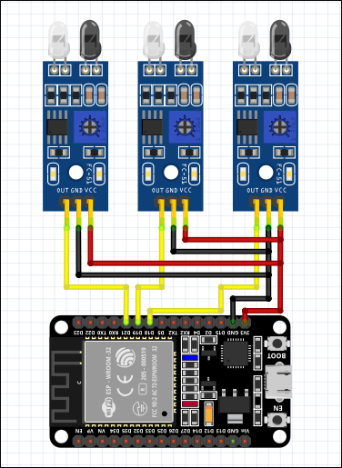
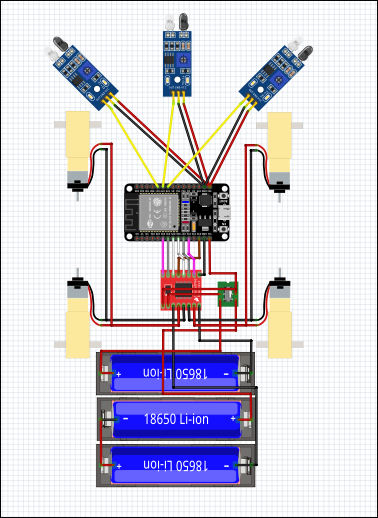

#Imperfect Line Tracking Robot
## Materials
1. [ESP32](https://lastminuteengineers.com/getting-started-with-esp32/)
2. [TB6612FNG Motor Driver Module](https://learn.sparkfun.com/tutorials/tb6612fng-hookup-guide/all)
3. DC Motors and Rubber Wheels (2 or 4)
4. Three (3) [FC-51 IR Sensor Module](https://microcontrollerslab.com/infrared-sensor-interfacing-arduino/)
5. 18650 Batteries and Battery Holder
6. [DPDT](https://www.mouser.com/datasheet/2/240/s-3050747.pdf) Switch
7. Wires
8. Chassis
---
## Steps
#### Wiring
- **Step 1:** Connect TB6612FNG Motor Driver to DC Motors. A01 and A02 pins are connected to the left motor(s). B01 and B02 pins are connected to the right motors.

	
- **Step 2:** Connect ESP32 to TB6612FNG Motor Driver. Follow the connections:
	GPIO 32 -> PWMA
    GPIO 25 -> AIN1
    GPIO 33 -> AIN2
    GPIO 13 -> STBY
    GPIO 14 -> PWMB
    GPIO 26 -> BIN1
    GPIO 27 -> BIN2
    
	
- **Step 3:** Connect FC-51 IR Sensor Modules to ESP32. Follow the connections: 
	3.3V      -> VCC (All 3 VCC Pins)
	GND      -> GND (All 3 GND Pins)
	GPIO 18 -> OUT (Right IR Sensor) 
	GPIO 19 -> OUT (Center IR Sensor) 
	GPIO 21 -> OUT (Left IR Sensor) 
	
	
- **Step 4:** Connect two (2) Power Source (18650 Battery) to TB6612FNG and ESP32. Follow the connections:
	> [!WARNING]
  > Proper Battery Voltage Rate
	> Batt1 for powering DC motors and should be within the rate of the motors
	> Batt2 for powering TB6612FNG and ESP32. The battery should be within both components' voltage rating to avoid breaking the components. (3V should be enough for this project)

	Batt1 + -> VM
	Batt1 - -> GND
	Batt2 + -> VCC and VIN (TB6612FNG & ESP32)
	Batt2 - -> GND (TB6612FNG & ESP32)
	![[Diagrams/PowerSupply-to-ESP32-TB6612FNG.png]]
#### Uploading Code

> [!IMPORTANT]
> Install PlatformIO
> The framework used in this project is esp-idf and it is not possible to copy and paste the code into arduino sketch. PlatformIO is the software used to compile and upload the code.

Use the command to clone the repo and change directory to it:
	`$ git clone https://github.com/Sishi-Source/Imperfect_Line_Tracking_Robot.git && cd Imperfect_Line_Tracking_Robot`
Compile and upload using the command:
	`$ pio run -t upload`

---
## Output

## Softwares
1. [Fritzing](https://github.com/fritzing/fritzing-app)
2. [PlatformIO](https://platformio.org/)

